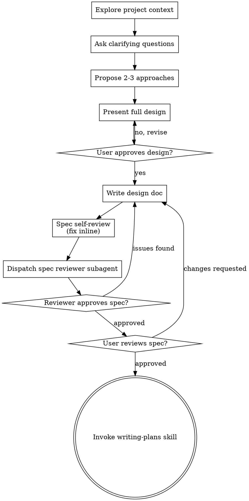

# Brainstorming Ideas Into Designs

Turn ideas into full designs/specs via collaborative dialogue.

Understand project context first. Ask questions one at time to refine idea. Once building clear, present design, get user approval.

<HARD-GATE>
No implementation skill, code, scaffold, or implementation action until design presented and user approved. Applies to EVERY project regardless of perceived simplicity.
</HARD-GATE>

**Announce at start:** "I'm using the brainstorming skill to create the spec plan."

## Anti-Pattern: "This Is Too Simple To Need A Design"

Every project goes through process. Todo list, single-function utility, config change — all. "Simple" projects = where unexamined assumptions waste most work. Design can be short (few sentences for simple projects), but MUST present and get approval.

## SPEC_FILE_PATH

`/home/hermes/.superpowers/YYYY/<feature-name>/spec/spec.md`

`YYYY` = current year (e.g. `2026`) — never create a literal `YYYY` directory.

Feature owns one directory — `/home/hermes/.superpowers/YYYY/<feature-name>/` —
everything in sibling subfolders: `spec/`, `plan/`, `sdd/`. Spec goes in `spec/spec.md`; plan (`plan/plan.md`) and task files (`plan/tasks/task.NN.md`) in `plan/` (see superpowers:writing-plans); SDD execution artifacts in `sdd/`.

## Checklist

MUST create task per item, complete in order:

1. **Explore project context** — files, docs, recent commits
2. **Ask clarifying questions** — one at time, understand purpose/constraints/success criteria
3. **Propose 2-3 approaches** — trade-offs plus recommendation
4. **Present design** — sections scaled to complexity, get approval — batch sections into one message unless design is long
5. **Write design doc** — save to [SPEC_FILE_PATH], commit
6. **Spec self-review** — quick inline check: placeholders, contradictions, ambiguity, scope (see below)
7. **Spec review (subagent)** — dispatch fresh reviewer with [spec-document-reviewer-prompt.md](spec-document-reviewer-prompt.md), fix issues found
8. **User reviews written spec** — user reviews spec file before proceeding
9. **Transition to implementation** — invoke writing-plans skill for implementation plan

## Process Flow

**Terminal state = invoking writing-plans.** NOT frontend-design, mcp-builder, or other implementation skill. ONLY skill after brainstorming: writing-plans.

## The Process

**Understanding the idea:**

- Check current project state first (files, docs, recent commits)
- Before detailed questions, assess scope: request describes multiple independent subsystems (e.g., "build a platform with chat, file storage, billing, and analytics") = flag immediately. No spending questions on project needing decomposition first.
- Project too large for single spec: help user decompose into sub-projects — independent pieces, relations, build order. Then brainstorm first sub-project through normal design flow. Each sub-project gets own spec → plan → implementation cycle.
- Appropriately-scoped projects: ask questions one at time
- Prefer multiple choice; open-ended fine too
- One question per message — topic needs more exploration, break into multiple questions
- Focus: purpose, constraints, success criteria

**Exploring approaches:**

- Propose 2-3 approaches with trade-offs
- Present options conversationally with recommendation and reasoning
- Lead with recommended option, explain why

**Presenting the design:**

- Once building clear, present full design in one message, sections scaled to complexity: few sentences if straightforward, up to 200-300 words per section if nuanced
- Ask for feedback ONCE on the whole design — one approval per artifact, not per section (mirrors batched-question pattern elsewhere in the workflow)
- Split into per-section approvals only when design is long (over ~300 words) or user already voiced doubts
- Cover: architecture, components, data flow, error handling, testing
- Ready to go back and clarify if something unclear

**Design for isolation and clarity:**

- Break system into small units: one clear purpose each, well-defined interfaces, understandable and testable independently
- Per unit, answer: what does it do, how use it, what does it depend on?
- Understand unit without reading internals? Change internals without breaking consumers? No = boundaries need work.
- Small well-bounded units easier for you too — better reasoning on code held in context at once, more reliable edits on focused files. Large file = often doing too much.

**Working in existing codebases:**

- Explore current structure before proposing changes. Follow existing patterns.
- Existing code problems affecting work (file grown too large, unclear boundaries, tangled responsibilities): include targeted improvements in design — like good developer improving code they work in.
- No unrelated refactoring. Stay focused on current goal.

## After the Design

**Documentation:**

- Write validated design (spec) to [SPEC_FILE_PATH]
- Commit design document to git

**Spec Self-Review:**
After writing spec document, fresh-eyes check:

1. **Placeholder scan:** "TBD", "TODO", incomplete sections, vague requirements? Fix.
2. **Internal consistency:** Sections contradict? Architecture match feature descriptions?
3. **Scope check:** Focused enough for single implementation plan, or needs decomposition?
4. **Ambiguity check:** Requirement interpretable two ways? Pick one, make explicit.

Fix issues inline. No re-review — fix, move on.

**Spec Review (subagent):**
After self-review, dispatch one fresh reviewer subagent using [spec-document-reviewer-prompt.md](spec-document-reviewer-prompt.md) with the spec path. Fresh eyes catch what the author cannot. Reviewer returns Status + Issues. Issues found: fix them, re-dispatch. Approved: proceed to user review.

**User Review Gate:**
After spec review loop passes, ask user to review written spec before proceeding:

> "Spec written and committed to [SPEC_FILE_PATH]. Review it and let me know if you want to make any changes before we start writing out the implementation plan."

Wait for user response. Changes requested = make them, re-run spec review loop. Proceed only after user approves.

**Implementation:**

- Invoke writing-plans skill for detailed implementation plan
- NO other skill. writing-plans = next step.

## Key Principles

- **One question at a time** - No overwhelming with multiple questions
- **Multiple choice preferred** - Easier than open-ended when possible
- **YAGNI ruthlessly** - Cut unnecessary features from all designs
- **Explore alternatives** - Always 2-3 approaches before settling
- **Batched validation** - One approval per artifact (design, spec, plan), not per section
- **Be flexible** - Go back, clarify when something unclear